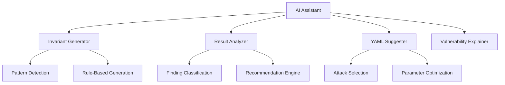

# Mistral AI Workflow Notes for ZkPatternFuzz

## Overview

Status (2026-02-23): the scanner has no hard runtime link to Mistral (or any AI provider).  
AI is an external user/operator workflow: the user reads code and fuzzer output artifacts, then runs analysis and remediation planning out-of-band.

The semantic pipeline exports handoff files (for example `ai_ingest_bundle.json` and `ai_exploitability_worklist.json`) but does not:
- call external AI APIs from scanner runtime
- host an embedded model runtime
- ingest AI responses automatically into scanner execution

This document should be read as workflow guidance and historical integration context, not as an active in-process AI integration contract.

## Features Implemented

### 1. AI Configuration System

**Configuration Structure:**
```yaml
ai_assistant:
  enabled: true
  model: "mistral"  # Options: "mistral", "claude", "gpt-4"
  temperature: 0.7   # 0.0-1.0, lower = more deterministic
  max_tokens: 1000
  modes:
    - invariant_generation
    - result_analysis
    - config_suggestion
    - vulnerability_explanation
  endpoint: "https://api.mistral.ai/v1"  # Optional
  api_key: "your-api-key"  # Optional, can use env var
```

### 2. AI Assistance Modes

| Mode | Description | Status |
|------|-------------|--------|
| `invariant_generation` | Generate candidate invariants from circuit patterns | ✅ Implemented |
| `result_analysis` | Analyze fuzzing results with actionable recommendations | ✅ Implemented |
| `config_suggestion` | Generate optimized YAML configurations | ✅ Implemented |
| `vulnerability_explanation` | Natural language vulnerability explanations | ✅ Implemented |
| `all` | Enable all modes | ✅ Implemented |

### 3. Pattern-Based Invariant Generation

The AI assistant automatically detects circuit patterns and generates relevant invariants:

**Merkle Tree Patterns:**
- `merkle_root_consistency: root == compute_merkle_root(leaves)`
- `merkle_path_validity: verify_merkle_path(root, leaf, path) == true`

**Nullifier Patterns:**
- `nullifier_uniqueness: nullifier not in used_nullifiers`
- `nullifier_range: nullifier < 2^252`

**Range Check Patterns:**
- `range_check: value < max_value`
- `bit_length: bit_length(value) <= max_bits`

**Signature Patterns:**
- `signature_validity: verify_signature(pk, message, signature) == true`
- `public_key_validation: is_valid_public_key(pk) == true`

**Hash Function Patterns:**
- `hash_collision_resistance: hash(input1) != hash(input2) for input1 != input2`
- `hash_preimage_resistance: find_preimage(hash) == impossible`

### 4. Result Analysis

The AI analyzes fuzzing results and provides:
- Automatic finding classification
- Severity assessment
- Recommended next steps
- Attack vector suggestions

### 5. YAML Configuration Generation

AI-generated YAML configurations include:
- Optimized attack selection based on circuit patterns
- Recommended parameters and timeouts
- AI assistant configuration
- Circuit-specific attack configurations

## Usage Examples

### Basic AI-Assisted Audit

```bash
# Run with AI assistance (Mistral model)
cargo run --release --bin zk-fuzzer -- --config templates/ai_assisted_audit.yaml
```

AI outputs are written to `reporting.output_dir/ai/`:
- `candidate_invariants.md`
- `suggested_campaign.yaml`
- `result_analysis.md`
- `top_finding_explanation.md`

### Custom AI Configuration

```yaml
# Enable specific AI modes
ai_assistant:
  enabled: true
  model: "mistral"
  modes:
    - invariant_generation
    - result_analysis
  temperature: 0.5  # More deterministic for security analysis
```

## Implementation Details

### Architecture



### Code Structure

```
src/
├── ai/
│   ├── mod.rs                  # Main AI assistant
│   ├── invariant_generator.rs  # Invariant generation
│   ├── result_analyzer.rs      # Result analysis
│   ├── yaml_suggester.rs       # YAML generation
│   └── tests.rs                 # Unit tests
└── config/
    └── v2.rs                    # AI configuration
```

## Integration with Pentest Workflow

### Phase 1: Skimmer (Enhanced with AI)
1. **Pattern Detection**: AI identifies circuit components (Merkle, nullifier, etc.)
2. **Invariant Generation**: AI generates candidate invariants
3. **Config Suggestion**: AI recommends optimal attack configuration
4. **Output**: Enhanced `candidate_invariants.yaml` with AI analysis

### Phase 2: Evidence Mode
1. **AI-Assisted Analysis**: AI helps interpret fuzzing results
2. **Finding Classification**: AI categorizes and prioritizes findings
3. **Recommendation Generation**: AI suggests next steps and remediation

### Phase 3: Deep Custom Fuzz
1. **Targeted Attack Generation**: AI suggests focused attack vectors
2. **Invariant Refinement**: AI helps refine invariants based on findings
3. **Result Interpretation**: AI explains complex vulnerability patterns

## Best Practices

### Configuration Recommendations

**For Security Audits:**
```yaml
ai_assistant:
  enabled: true
  model: "mistral"
  temperature: 0.5  # Lower for more deterministic security analysis
  modes:
    - invariant_generation
    - result_analysis
    - vulnerability_explanation
```

**For Exploratory Testing:**
```yaml
ai_assistant:
  enabled: true
  model: "mistral"
  temperature: 0.8  # Higher for more creative suggestions
  modes:
    - invariant_generation
    - config_suggestion
    - all
```

### Performance Considerations

- **Temperature**: 0.5-0.8 recommended for security analysis
- **Max Tokens**: 1000 sufficient for most circuit analyses
- **Mode Selection**: Start with `invariant_generation` and `result_analysis`

## Future Enhancements

### Planned Features

1. **Actual AI API Integration**
   - Implement real Mistral API calls
   - Add rate limiting and error handling
   - Support for multiple AI providers

2. **Enhanced Pattern Detection**
   - Deep circuit analysis using AST parsing
   - Cross-circuit pattern correlation
   - Historical vulnerability pattern matching

3. **Advanced Result Analysis**
   - Automated severity scoring
   - CVE mapping and references
   - Remediation suggestions

4. **Interactive Mode**
   - Real-time AI chat during fuzzing
   - Interactive invariant refinement
   - Collaborative vulnerability analysis

## Testing

All AI features include comprehensive unit tests:

```bash
# Run AI-specific tests
cargo test --lib ai
```

Test coverage includes:
- AI assistant creation and configuration
- Mode enabling/disabling logic
- Invariant generation for different circuit patterns
- YAML configuration generation
- Result analysis functionality

## Documentation

- **AI Pentest Rules**: Updated with AI workflow integration
- **Template**: `templates/ai_assisted_audit.yaml` - Example AI configuration
- **README**: Updated with AI features and usage examples
- **Configuration Guide**: Detailed AI configuration options

## Compatibility

- **Backward Compatible**: AI features are optional and disabled by default
- **No Breaking Changes**: Existing configurations work without modification
- **Graceful Degradation**: AI features fail gracefully if disabled or unavailable

## License

The Mistral AI integration is part of ZkPatternFuzz and licensed under BSL 1.1 (converts to Apache 2.0 in 2028).

## Support

For issues or questions about the Mistral AI integration:
- Open a GitHub issue with `[AI]` prefix
- Include circuit information and configuration
- Provide relevant logs and error messages

## Changelog

**v0.1.0 (February 2026)**
- Initial Mistral AI integration
- Pattern-based invariant generation
- Result analysis and YAML suggestion
- Comprehensive testing suite
- Documentation and examples

**Future Releases**
- Real AI API integration
- Enhanced pattern detection
- Interactive analysis mode
- Advanced vulnerability mapping
